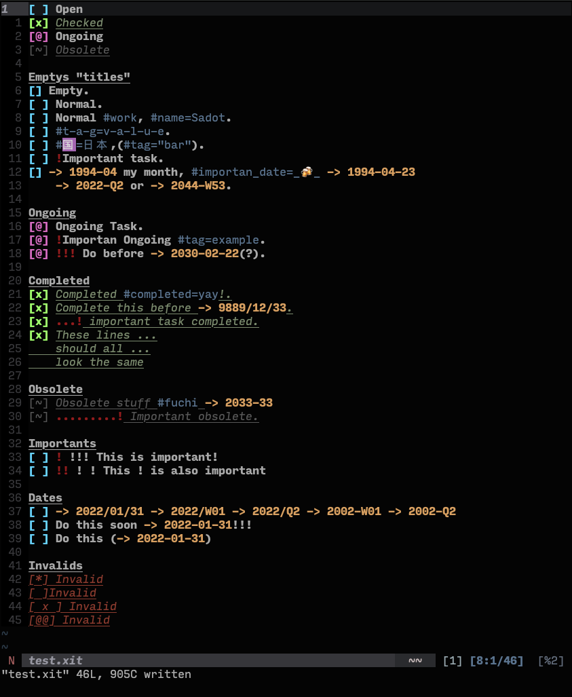
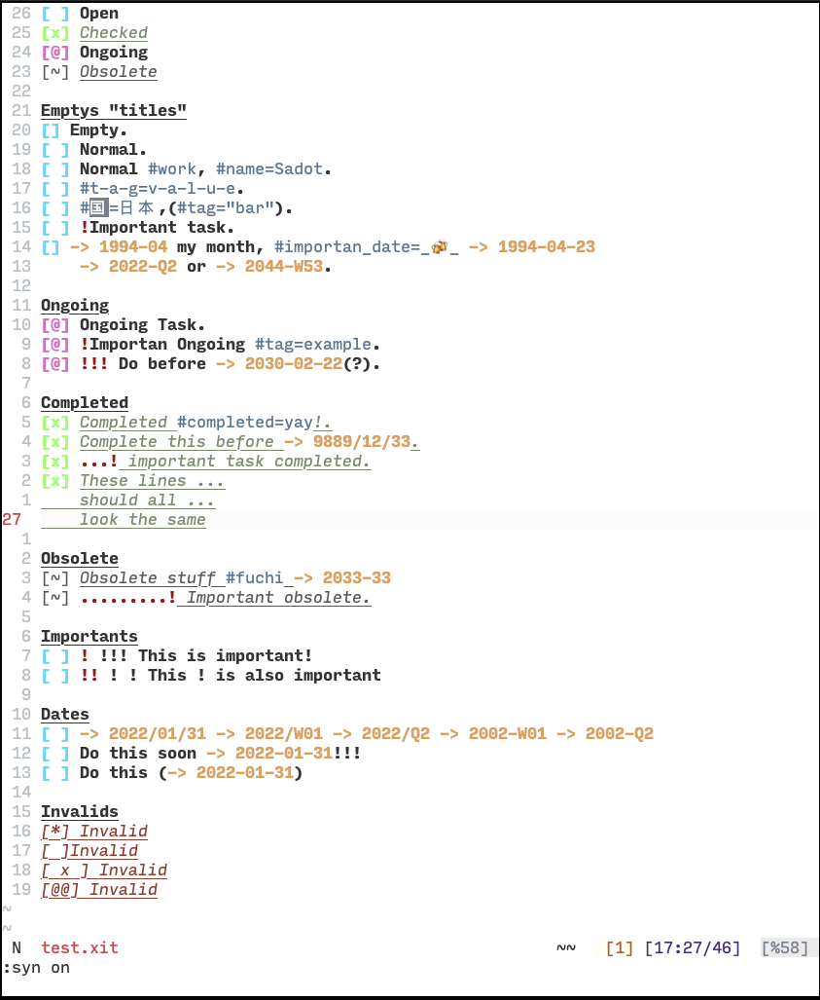
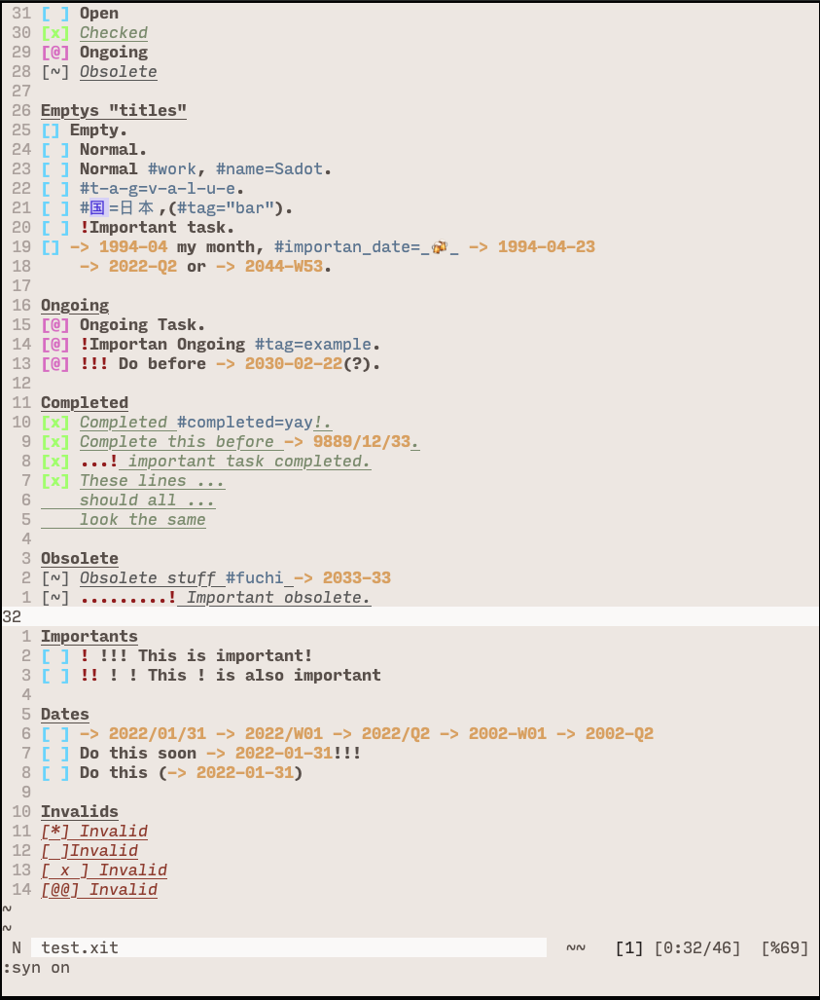
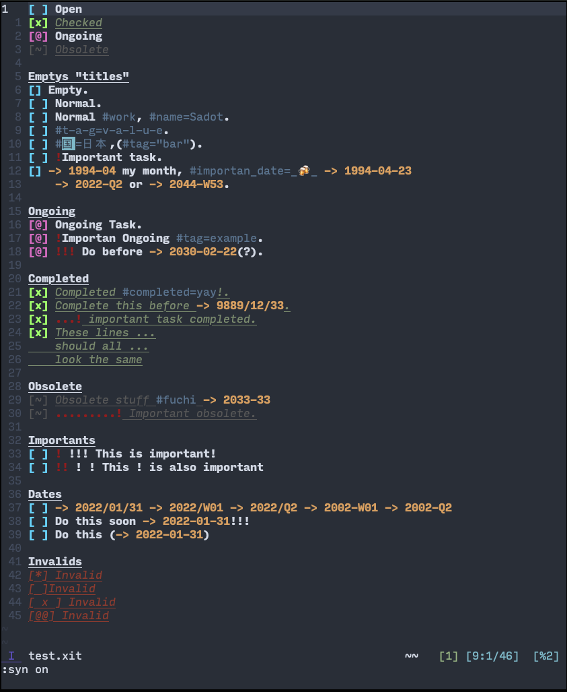

# [x]it! syntax plugin

Inspired by [ryanolsonx plugin](https://github.com/ryanolsonx/vim-xit) with my personal taste of salt.

## Examples of syntax highlighting

[Darkforce theme](https://github.com/sadotsoy/darkforce-vim)


[Breve](https://github.com/AlessandroYorba/Breve)


[Yui](https://github.com/cideM/yui)


[Nord](https://github.com/arcticicestudio/nord-vim)


## Features

- Indentation, the identation exists when we add text in multiple line using the first character column from the previous line.

- According with [jotaen specifiction](https://github.com/jotaen/xit/blob/main/Specification.md#checkbox) the checkboxes must be a sequence of 3 characters, including white space, but I like the approach to have empty checkboxes `[]`, so for default a empty checkbox is valid, if you want to invalid it you should add in your config file `g:xit_invalid_empty_checkboxes = 1`.

## Instalation

### Vim Packages

Using the built in package loader in Vim.

```bash
mkdir -p ~/.vim/pack/3rd/start
cd ~/.vim/pack/3rd/start
git clone https://github.com/sadotsoy/xit-vim
```

### Plug

Using [vim-plug](https://github.com/junegunn/vim-plug):

```viml
Plug 'sadotsoy/xit-vim'
```

### Vundle

Using [Vundle](https://github.com/VundleVim/Vundle.vim):

```viml
Plugin 'sadotsoy/xit-vim'
```

## Contributing

- I've added a [todo.xit](./todo.xit) file where I'll add a stuff to add, be free to take resolve it.

- If you think you can make this plugin better, send a pull request.

## License

MIT
